# terraform-three-tier-infra

# WEEK 1
Production-style 3-tier AWS architecture provisioned end-to-end with Terraform — VPC, ALB, Auto Scaling Group, and RDS — using a modular, real-world layout.

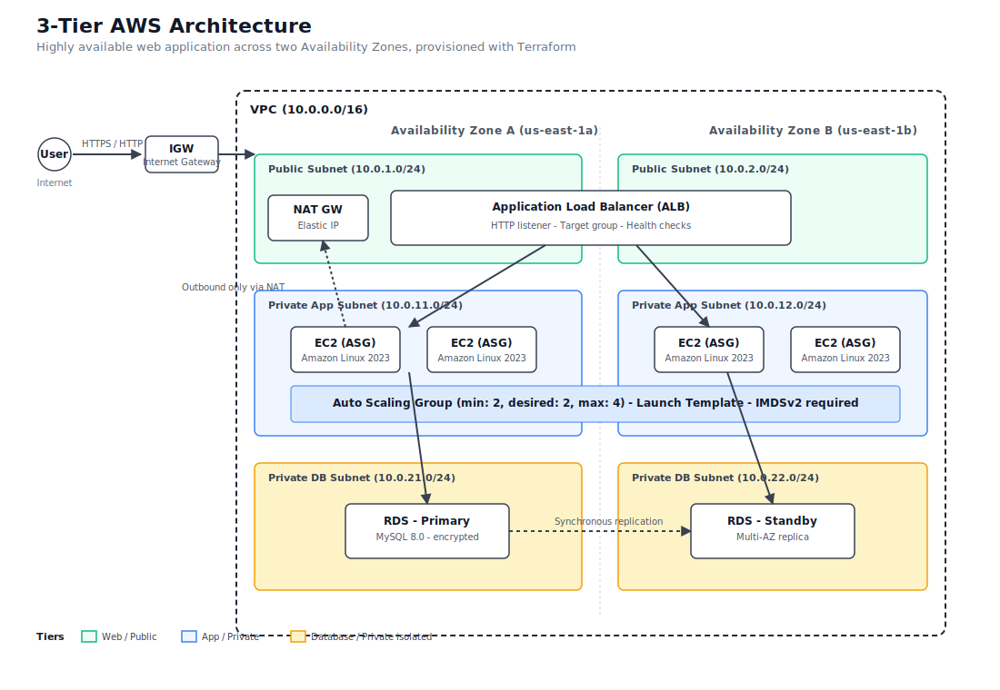

---

## Overview

This project provisions a classic **3-tier architecture** on AWS:

- **Web tier** — public Application Load Balancer (ALB) accepting HTTP traffic
- **App tier** — EC2 Auto Scaling Group in private subnets, only reachable through the ALB
- **Database tier** — RDS instance in isolated private subnets, only reachable from the app tier

Everything is deployed across **two Availability Zones** for high availability and provisioned as code with Terraform.

---

## Tech Stack

| Layer            | Service / Tool                                  |
| ---------------- | ----------------------------------------------- |
| IaC              | Terraform >= 1.5, AWS Provider ~> 5.0           |
| Networking       | VPC, public + private subnets, IGW, NAT Gateway |
| Web tier         | Application Load Balancer                       |
| App tier         | EC2, Launch Template, Auto Scaling Group        |
| Database tier    | RDS MySQL 8.0                                   |
| State management | S3 + DynamoDB (remote backend)                  |
| CI               | GitHub Actions (fmt / validate / plan)          |

---

## Features

- **High availability** across two Availability Zones for every tier
- **Strict network segmentation** with separate public, app, and DB subnets
- **Defense in depth** using security groups that reference each other rather than CIDR blocks
- **No public IPs** on app or DB instances — outbound internet only via NAT Gateway
- **Auto Scaling Group** with Launch Template and **IMDSv2 enforced**
- **Automatic instance refresh** on Launch Template changes
- **Encryption at rest** for RDS storage
- **Resource tagging** via provider `default_tags` + per-resource tags

---

## Architecture & Design Decisions

### Why a 3-tier design?
The 3-tier pattern cleanly separates concerns: the web tier terminates public traffic, the app tier runs business logic in a security boundary, and the database tier is isolated even further. This enforces defense in depth at the network layer.

### Why one NAT Gateway instead of two?
To save cost (~$32/month per NAT). The trade-off: if AZ-A goes down, instances in AZ-B lose outbound internet. Production should run one NAT per AZ.

### Why Launch Template instead of Launch Configuration?
Launch Configurations are deprecated. Launch Templates support IMDSv2 enforcement and mixed instance types — the only forward-compatible choice.

### Why security-group-to-security-group references?
App SG references ALB SG; DB SG references App SG. Tighter, scales without rewriting CIDR lists, and survives subnet changes.

### Why parameterize `multi_az` and `backup_retention_period`?
The same Terraform code runs in dev (single-AZ, no backups) and production (Multi-AZ, 7-day backups) by flipping two variables. This is exactly how production teams parameterize environment-specific settings.

### Why automatic instance refresh on Launch Template changes?
By default, Terraform updates the Launch Template version but doesn't replace running instances — they keep serving the old user_data. Adding `instance_refresh` with `triggers = ["launch_template"]` rolls instances automatically on every apply.

---

## Deploy

```bash
# 1. Configure
cp terraform.tfvars.example terraform.tfvars
# edit terraform.tfvars (set db_username and db_password)

# 2. Provision
make init
make fmt
make validate
make plan
make apply

# 3. Test
curl $(terraform output -raw alb_dns_name)

# 4. Destroy when done
make destroy
```

---

# Live Deployment

The infrastructure was deployed end-to-end and validated before being destroyed to control costs.

## Terraform apply Output:

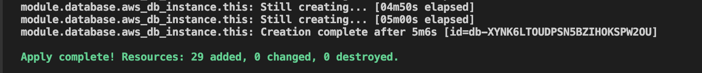

## Network Layer: 

### VPC Resource Map

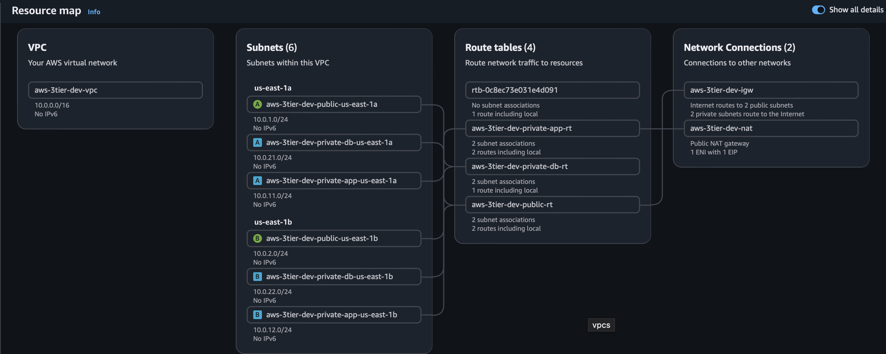

## Security Boundaries:

### Security Groups 

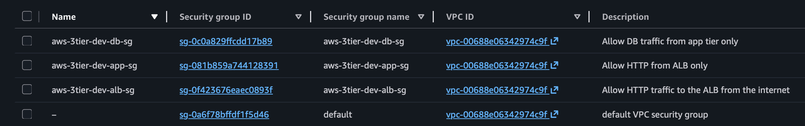

## Web Layer:

### ALB DNS

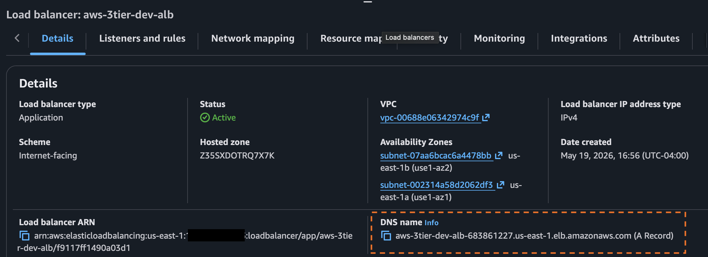

### Load balancing across instances 

**az-1a and az-1b**

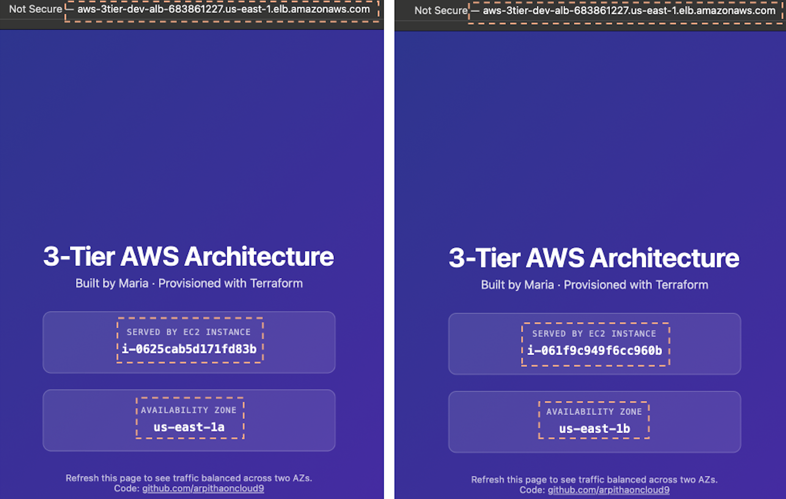

## Compute Layer:

### ASG Capacity

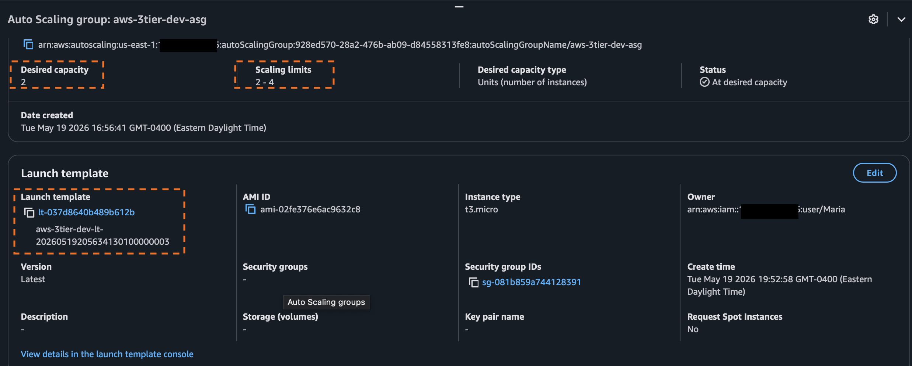

### EC2 Instances Across AZs

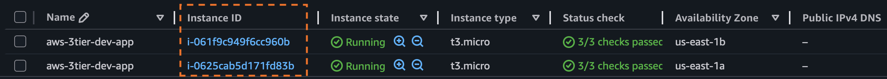

### Registered Healthy Targets

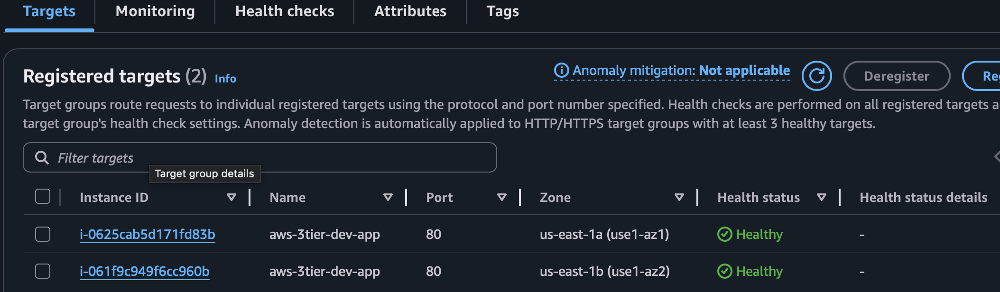

## Database tier:

### DB Instance 

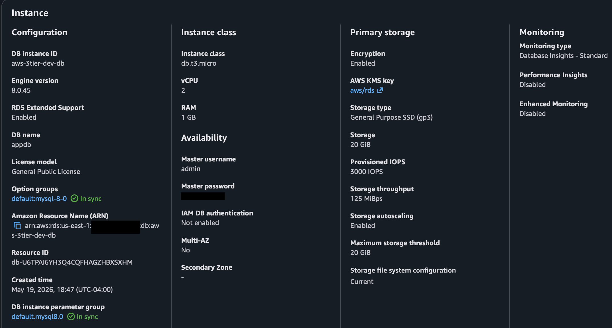

---

## Cost Estimate

For a single `dev` deployment in `us-east-1` left running continuously:

| Resource                         | Approx. monthly cost |
| -------------------------------- | -------------------- |
| 2 × t3.micro EC2 (ASG)           | ~$15                 |
| Application Load Balancer        | ~$22                 |
| NAT Gateway                      | ~$32                 |
| RDS db.t3.micro (single-AZ)      | ~$15                 |
| **Total (idle)**                 | **~$85 / month**     |

Always run `make destroy` between test sessions.

---

## What I Learned

- **Module boundaries matter.** Picking what goes in `vpc/` vs `alb/` vs `compute/` is the difference between reusable code and tangled code.
- **Security group references over CIDR blocks** is a small decision that quietly makes infrastructure much safer and easier to evolve.
- **IMDSv2 enforcement catches subtle bugs.** When I enforced IMDSv2 on the Launch Template, my initial user_data (using IMDSv1 curl calls) silently failed to fetch instance metadata — taught me to validate user_data assumptions against the metadata service version in use.
- **Launch Template updates don't auto-refresh ASG instances.** Adding `instance_refresh` with `triggers = ["launch_template"]` is the production-grade way to handle this — Terraform now rolls instances on every Launch Template change.
- **Free Plan constraints can push code in the right direction.** Parameterizing Multi-AZ and backup retention was forced by the Free Plan but ended up being a more flexible design than hardcoding production-only values.

---

## License

MIT


# WEEK 2 - Remote State Management

Terraform state is stored remotely in S3 with DynamoDB locking to support
team collaboration and prevent state corruption.

## Why Remote State?

By default, Terraform stores state locally in `terraform.tfstate`. This works
for solo projects but breaks immediately in a team or CI environment — two
engineers running `apply` simultaneously will corrupt each other's state.

This project uses:
- **S3** as the single source of truth for state storage (with versioning, so
  every change is recoverable)
- **DynamoDB** for state locking — prevents concurrent applies from running at
  the same time

## Bootstrap (One-Time Manual Setup)

The S3 bucket and DynamoDB table cannot be managed by Terraform itself
(chicken-and-egg problem). Create them once manually before running
`terraform init`:

```bash
# Create S3 bucket

aws s3api create-bucket \
  --bucket <your-bucket-name> \
  --region us-east-1

# Enable versioning

aws s3api put-bucket-versioning \
  --bucket <your-bucket-name> \
  --versioning-configuration Status=Enabled

# Block public access

aws s3api put-public-access-block \
  --bucket <your-bucket-name> \
  --public-access-block-configuration \
    "BlockPublicAcls=true,IgnorePublicAcls=true,BlockPublicPolicy=true,RestrictPublicBuckets=true"

# Create DynamoDB lock table

aws dynamodb create-table \
  --table-name terraform-state-lock \
  --attribute-definitions AttributeName=LockID,AttributeType=S \
  --key-schema AttributeName=LockID,KeyType=HASH \
  --billing-mode PAY_PER_REQUEST \
  --region us-east-1
```

## Activate the Backend

Update `backend.tf` with your bucket name, then run:

```bash
terraform init -migrate-state
```

Terraform will prompt you to confirm the migration. Type `yes`. After this,
state lives in S3 — your local `terraform.tfstate` is no longer the source
of truth.

## Backend Configuration

See [`backend.tf`](./backend.tf) for the full configuration.

```hcl
terraform {
  backend "s3" {
    bucket         = "your-bucket-name"
    key            = "aws-3tier-architecture/terraform.tfstate"
    region         = "us-east-1"
    dynamodb_table = "terraform-state-lock"
    encrypt        = true
  }
}
```

## Verification

After running `terraform init -migrate-state`, verify the state file landed
in S3:

```bash
aws s3 ls s3://<your-bucket-name>/aws-3tier-architecture/
```

You should see `terraform.tfstate` listed. Run `terraform plan` to confirm
state integrity — output should reflect your current infrastructure with no
unexpected changes.

## Screenshots

| Resource | Details |
|----------|---------|
| 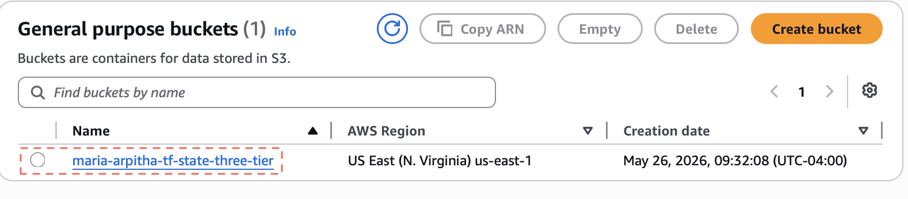 | State bucket in us-east-1 with versioning enabled |
| 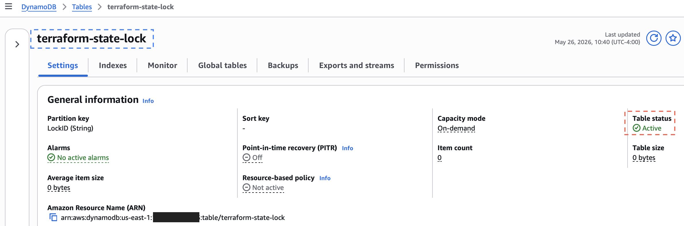 | `terraform-state-lock` table — Active, LockID partition key |
| 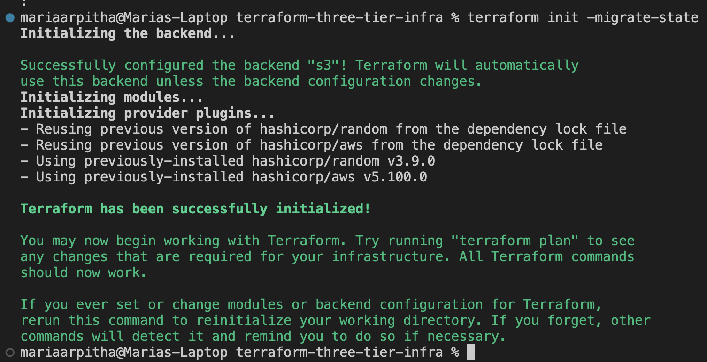 | Backend migration — `Successfully configured the backend 's3'`|
| 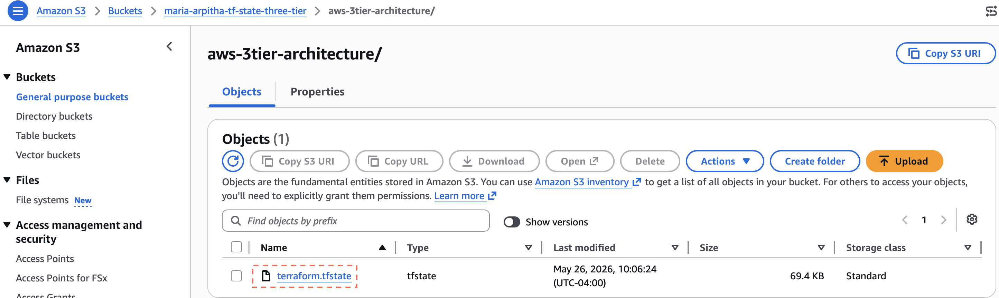 | `terraform.tfstate` stored under `aws-3tier-architecture/` |

---

# Week 3 — CI/CD Pipeline with GitHub Actions

## What I Did

Set up a fully automated CI/CD pipeline using GitHub Actions so that Terraform never runs manually from a laptop again.

Two workflows run automatically inside `.github/workflows/terraform.yaml`:

- **On every Pull Request → `terraform plan`** — formats check, validates config, runs a plan, and posts the output as a PR comment so you can review exactly what will change before it hits AWS
- **On merge to main → `terraform apply`** — automatically provisions the infrastructure on AWS

## How It Works

```
Developer pushes code to a feature branch
           │
    Opens Pull Request
           │
    GitHub Actions triggers:
      ✅ terraform fmt -check   (is the code formatted correctly?)
      ✅ terraform validate     (is the syntax valid?)
      ✅ terraform plan         (what will change on AWS?)
      📝 Plan posted as PR comment
           │
    Review the plan → merge when happy
           │
    GitHub Actions triggers:
      🚀 terraform apply        (29 resources created on AWS automatically)
```

## Why It's Important

Before CI/CD, the risk with Terraform is that anyone can run `terraform apply` from their laptop at any time — even with untested or broken code. In a team, two people could run apply at the same time and corrupt the state file.

This pipeline solves three real problems:

**1. Visibility** — the plan-as-PR-comment means you see *exactly* what Terraform will create, change, or destroy before it happens. No surprises.

**2. Safety** — the `fmt` and `validate` checks catch formatting errors and syntax issues automatically. Bad code never reaches AWS.

**3. Consistency** — infrastructure changes only happen through the pipeline. No one applies from their local machine. Every change is traceable to a commit and a PR.

## GitHub Secrets Used

Sensitive values are stored as GitHub repository secrets, never hardcoded in code:

| Secret | Purpose |
|---|---|
| `AWS_ACCESS_KEY_ID` | Authenticate to AWS |
| `AWS_SECRET_ACCESS_KEY` | Authenticate to AWS |
| `TF_VAR_db_username` | RDS master username |
| `TF_VAR_db_password` | RDS master password |

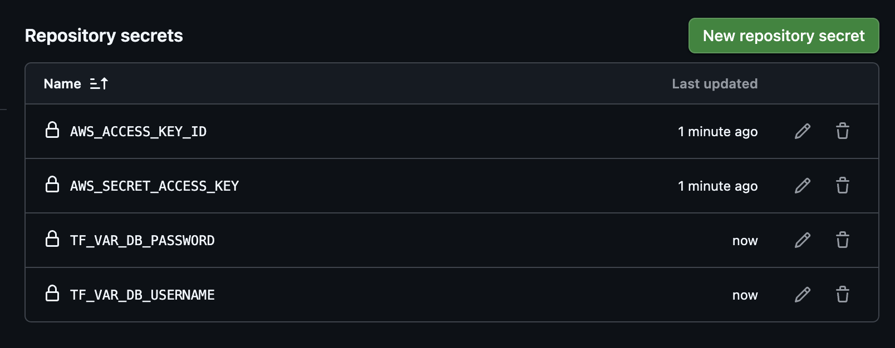


## Feature branch pushed — Compare & pull request
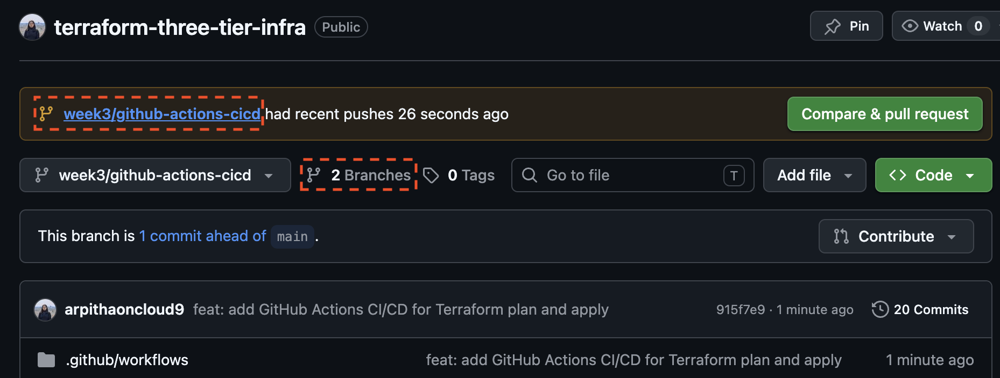


## Terraform Plan posted as PR comment
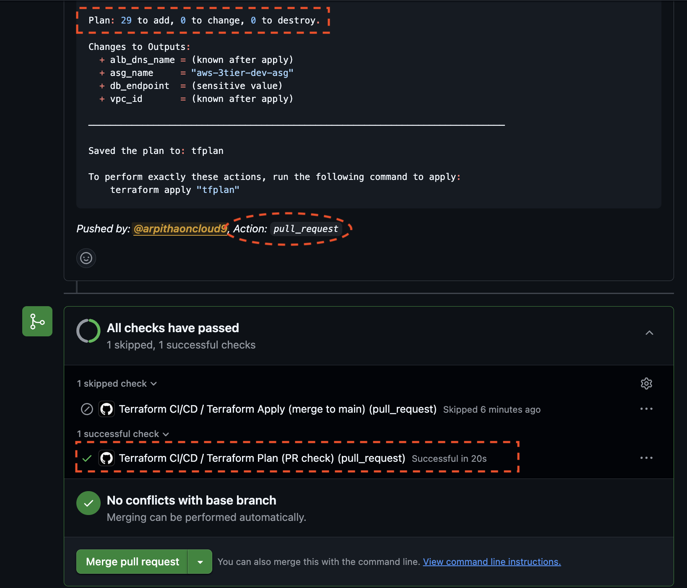


## PR merged — Terraform Apply triggered automatically
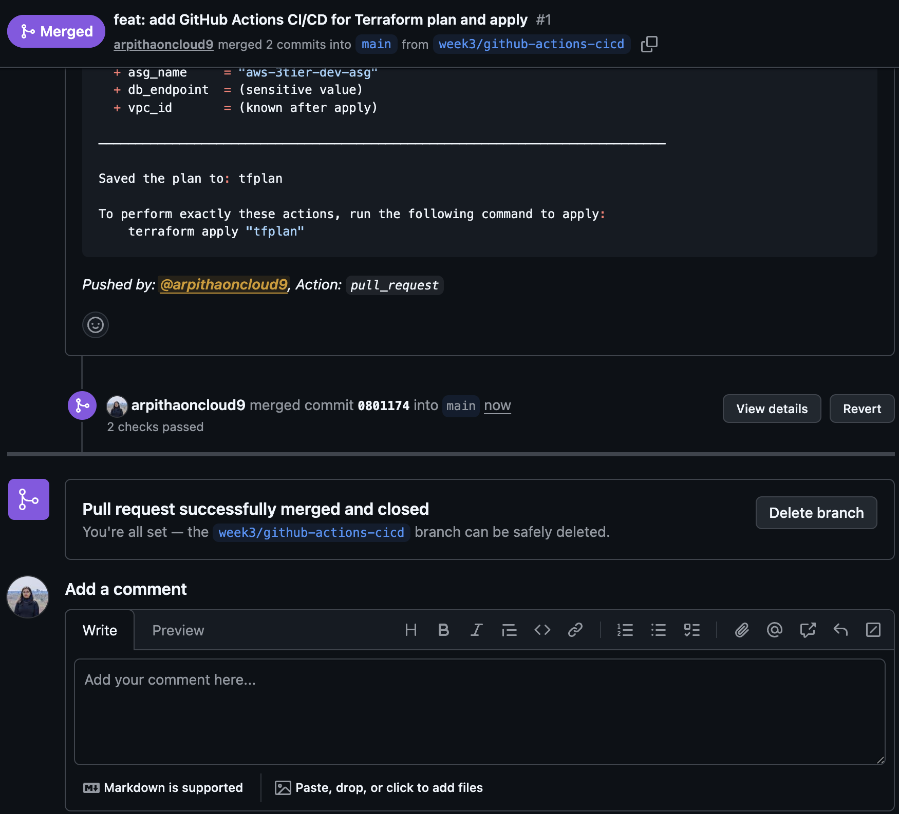


## Result

After merging the PR, the Apply job ran automatically and provisioned the full 3-tier infrastructure:

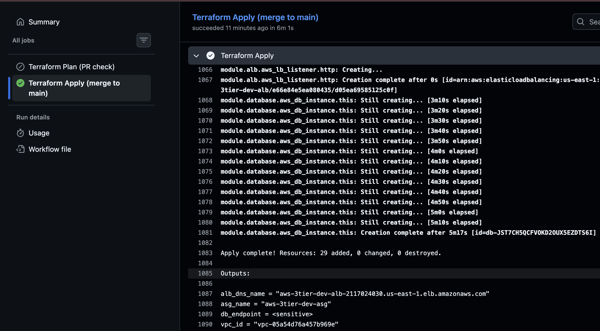

```
Apply complete! Resources: 29 added, 0 changed, 0 destroyed.

Outputs:
  alb_dns_name = "aws-3tier-dev-alb-2117024030.us-east-1.elb.amazonaws.com"
  asg_name     = "aws-3tier-dev-asg"
  vpc_id       = "vpc-05a54d76a457b969e"
```

29 AWS resources — VPC, subnets, ALB, ASG, RDS, security groups — created automatically with zero manual steps.

---

# Week 4: Dockerize the App + Push to AWS ECR 🐳

### Overview

Containerized the Node.js application using Docker and integrated it with AWS ECR (Elastic Container Registry). Extended the GitHub Actions CI/CD pipeline to automatically build Docker images and push them to ECR. Updated EC2 instances to pull and run the containerized app on startup. Debugged and resolved multiple infrastructure issues to achieve a fully automated app deployment pipeline. App is now live on ALB DNS! 🎉

What I Built This Week:

## 1. Node.js App

▸ Simple server returning an HTML webpage
▸ Displays instance metadata (Instance ID, Availability Zone)
▸ Listens on port 3000
▸ Location: app/server.js

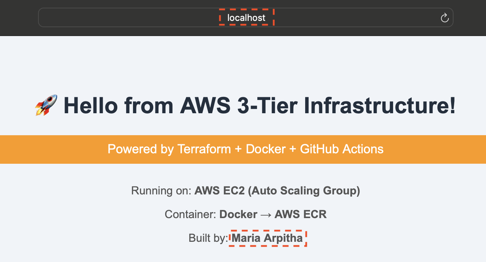

## 2. Dockerfile

▸ Multi-stage Docker image
▸ Based on Node.js runtime
▸ Installs dependencies from package.json
▸ Exposes port 3000
▸ Location: app/Dockerfile

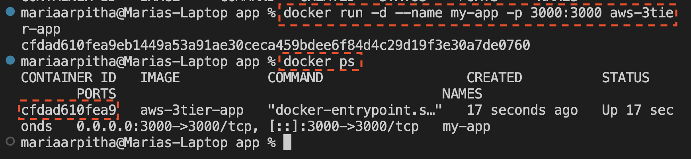

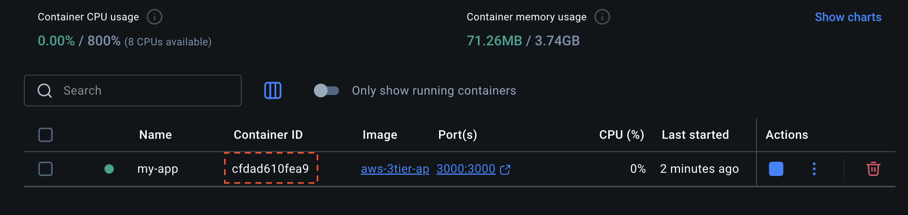

## 3. AWS ECR Repository 

▸ Private Docker registry in AWS
▸ Stores containerized app images
▸ Tagged with commit hash and latest
▸ Created via GitHub Actions automation

## 4. GitHub Actions Docker Pipeline 

▸ Automatically builds Docker image on push to main
▸ Authenticates with AWS ECR
▸ Pushes image with commit hash tag
▸ Pushes latest tag for easy reference
▸ File: .github/workflows/terraform.yaml

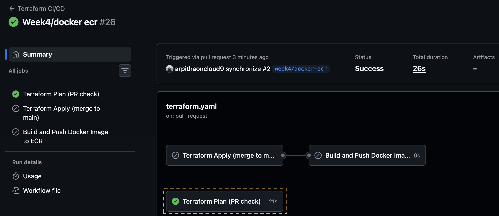

## 5. EC2 User Data Script Updates

▸ Instances install Docker on startup
▸ Pull image from ECR using IAM role credentials
▸ Run container with proper port mapping (80→3000)
▸ Pass environment variables (Instance ID, AZ)
▸ Location: modules/compute/main.tf (user_data locals)

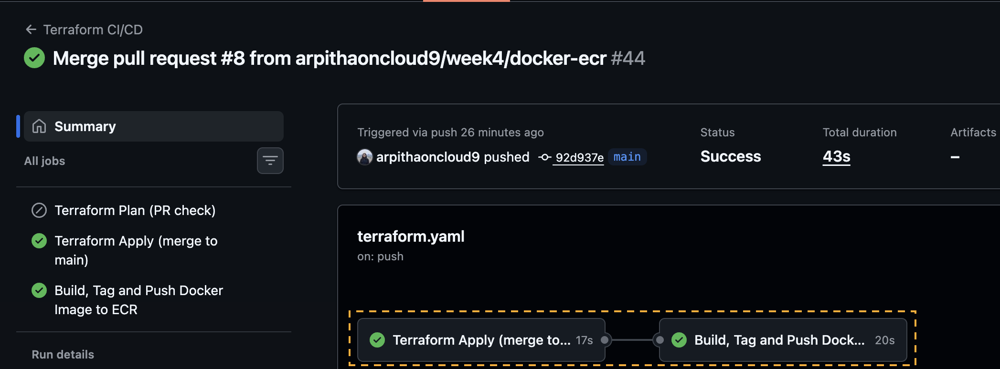

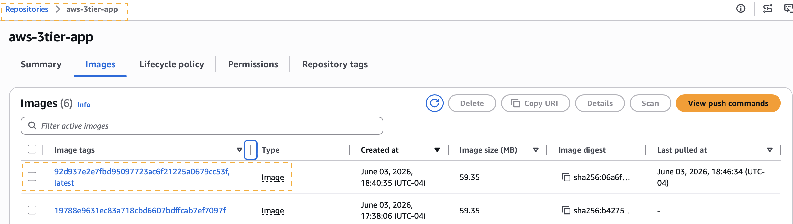

## 6. IAM Configuration 

▸ EC2 role with ECR read-only permissions
▸ EC2 instances can authenticate to ECR without hardcoded credentials
▸ SSM permissions for Session Manager access
▸ Location: modules/compute/main.tf

## 7. App Live on ALB 

▸ Load balancer routing traffic to healthy targets
▸ Instances pulling latest image from ECR
▸ Docker container running the app
▸ App accessible at ALB DNS name 🚀
▸ Final result - App live!

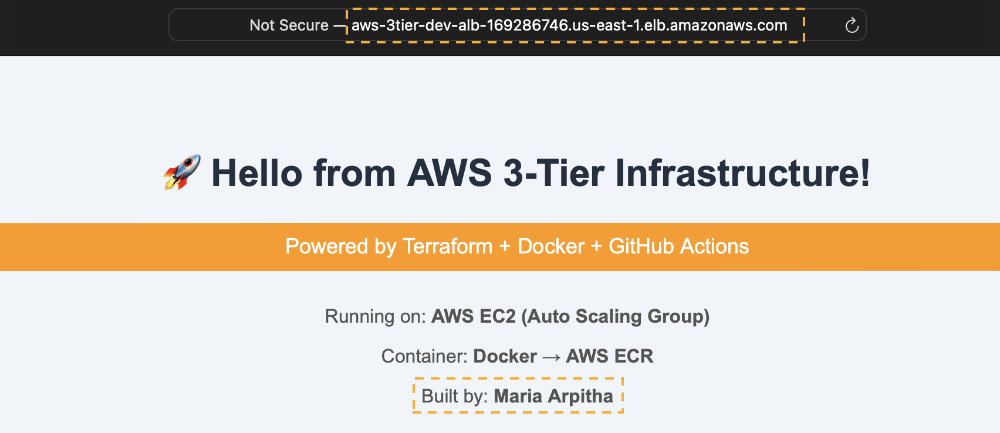


# Deployment Flow

Step 1: Write Code
  ├─ app/server.js (Node.js app)
  ├─ app/Dockerfile (Docker image)
  └─ Infrastructure changes (Terraform)
       │
Step 2: git push to feature branch
       │
Step 3: Create Pull Request
       │
Step 4: GitHub Actions runs on PR:
       ├─ ✅ terraform fmt -check
       ├─ ✅ terraform validate
       ├─ ✅ terraform plan (shows what will change)
       ├─ 📝 Posts plan as PR comment
       └─ 🏗️ (Docker build step runs on merge only)
       │
Step 5: Review PR and plan
       │
Step 6: Merge to main
       │
Step 7: GitHub Actions automatically runs:
       ├─ 🚀 terraform apply (deploys infrastructure)
       ├─ 🐳 docker build (builds Docker image)
       ├─ 📦 docker push (pushes image to ECR with :latest tag)
       │
Step 8: ASG launches new instances:
       ├─ Instances boot
       ├─ Docker installs
       ├─ aws ecr get-login-password (authenticates via IAM)
       ├─ docker pull :latest (pulls your image)
       ├─ docker run (starts container on port 80)
       │
Step 9: Health checks pass
       ├─ ALB checks port 80 ✅
       ├─ Container responds ✅
       └─ Target becomes Healthy ✅
       │
Step 10: App Live!
       └─ ALB routes traffic → App running 🎉


# Issues Encountered & Solutions

## Issue 1: Docker Permission Denied ❌

▸ Problem: docker logs app failed with permission error
▸ Solution: Added usermod -a -G docker ec2-user to user_data script

## Issue 2: IAM Role Not Attached ❌❌❌ (CRITICAL)

▸ Problem: Instances had no IAM credentials to pull from ECR
▸ Symptoms:

curl http://169.254.169.254/latest/meta-data/iam/security-credentials/ returned empty
ECR image pull failed silently
Docker container never started
Health checks failed
App was unreachable

▸ Root Cause: Launch template was using name instead of arn for IAM instance profile
▸ Solution: Changed to ARN reference (this was the critical fix!)

```hcl
# ❌ This didn't work:
iam_instance_profile {
  name = aws_iam_instance_profile.ec2_profile.name
}

# ✅ This worked:
iam_instance_profile {
  arn = aws_iam_instance_profile.ec2_profile.arn
}
``` 
## Issue 3: Health Check Grace Period Too Short ⚠️

▸ Problem: Instances killed before Docker finished starting
▸ Solution: Increased to 300 seconds

```hcl
health_check_grace_period = 300  # from 60 seconds
```

# Issue 4: Docker Image Not Tagged as latest ❌

▸ Problem: User data pulled :latest but tag didn't exist in ECR
▸ Symptoms:

docker pull failed with "manifest not found"
Container never started
Instance kept getting replaced by ASG

▸ Solution: Updated GitHub Actions to push both commit hash AND latest tag

```yaml
docker tag $ECR_REGISTRY/$ECR_REPOSITORY:$IMAGE_TAG $ECR_REGISTRY/$ECR_REPOSITORY:latest
docker push $ECR_REGISTRY/$ECR_REPOSITORY:latest
```

# Learnings & Lessons

## Key Lessons from This Week:

▸ IAM Instance Profiles: Always use arn not name in launch templates
▸ Docker Tags: Tag images with both commit hash AND latest
▸ Health Checks: Give instances enough time to start (300+ seconds)
▸ Session Manager: Better than SSH for secure instance access
▸ Metadata Queries: Always verify IAM role with: curl http://169.254.169.254/latest/meta-data/iam/security-credentials/
▸ User Data Scripts: Test startup scripts locally before deploying
▸ ECR Permissions: EC2 role needs AmazonEC2ContainerRegistryReadOnly      

# Conclusion

## You've built a production-grade containerized application with fully automated deployment!

▸ Infrastructure as Code ✅
▸ Remote state management ✅
▸ Automated CI/CD pipeline ✅
▸ Containerized application ✅
▸ Zero-manual deployments ✅

## Your app is now:

🐳 Running in Docker containers
🚀 Deployed automatically via GitHub Actions
📦 Stored in AWS ECR
⚖️ Load-balanced via ALB
🔄 Auto-scaling across availability zones
🎉 LIVE and accessible at your ALB DNS!